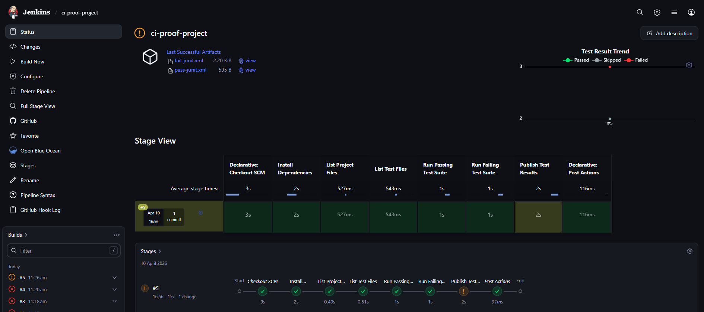
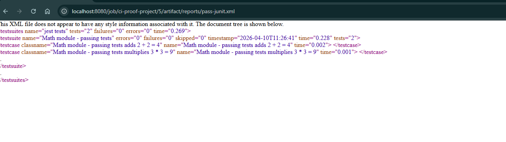
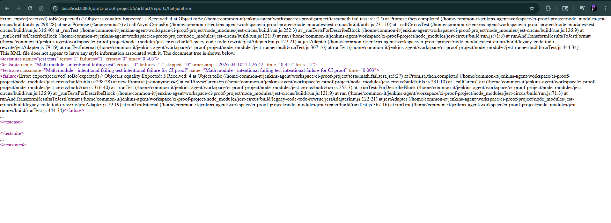
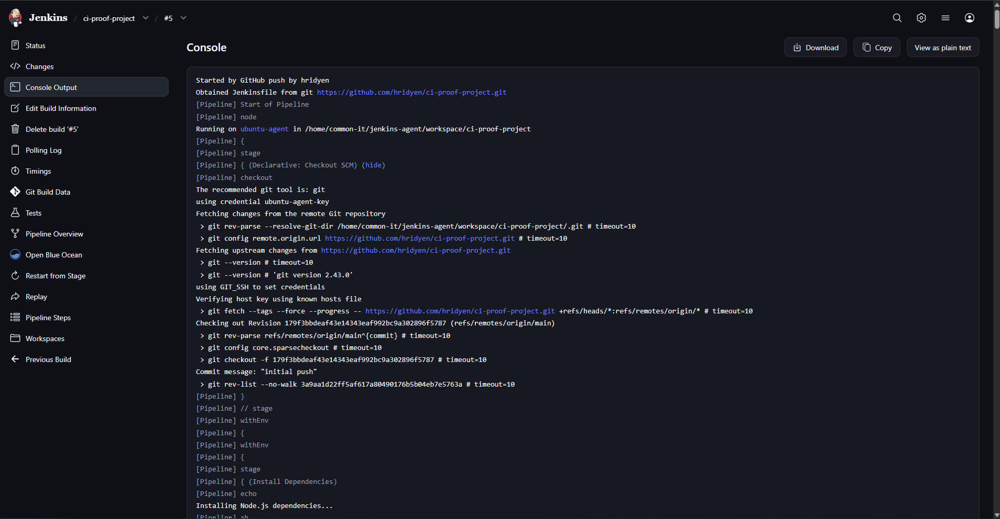
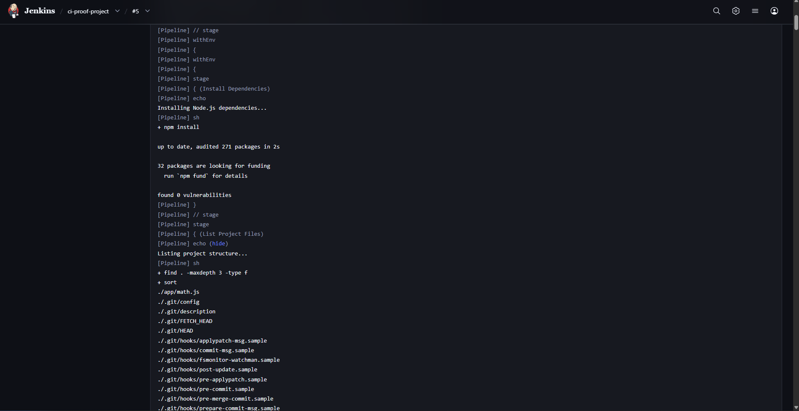
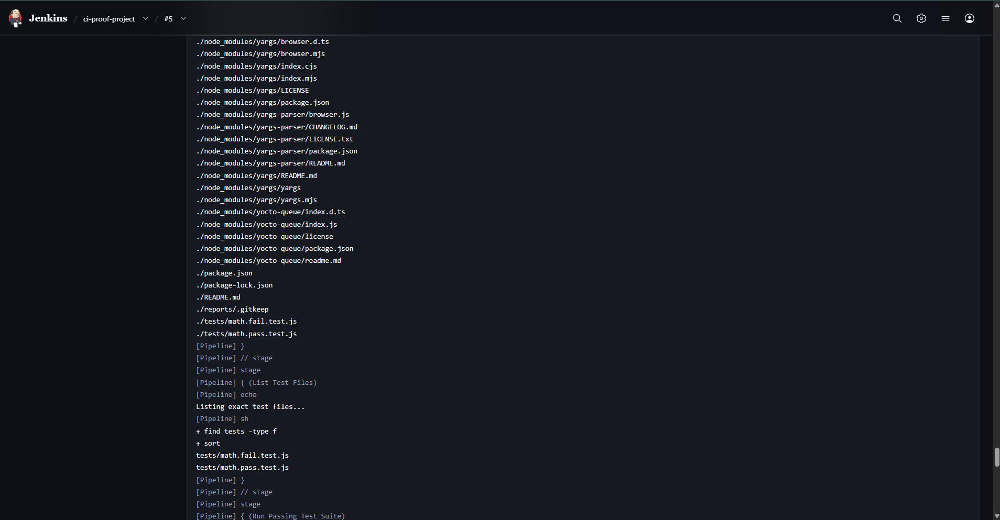
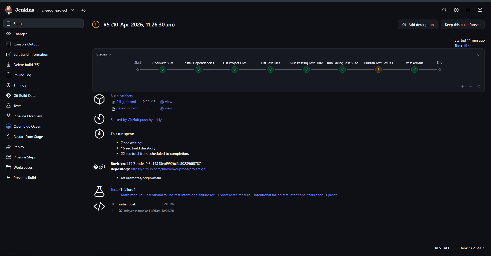

# ci-proof-project

### Branch-Aware CI/CD Pipeline Proof of Concept

---

## Overview
This repository serves as a Research and Development (R&D) Proof of Concept (PoC) designed to validate core CI/CD functionalities and automated testing workflows. The project demonstrates a minimum viable CI proof milestone by integrating Jenkins, Node.js, and Jest within an isolated sandbox environment.

> [!NOTE]
> This is a non-production system. It is a controlled environment for CI/testing research and demonstration of traceability from requirements to execution evidence.

---

## Objectives
- Validate a working CI job definition.
- Implement a committed automated test path.
- Generate passing test run artifacts (pass-junit.xml).
- Generate failing test run artifacts (fail-junit.xml) to verify failure detection mechanisms.
- Ensure full traceability through ticket-to-PR mapping and exact file inventory management.

---

## Tech Stack
- **Runtime**: Node.js
- **Test Framework**: Jest
- **Reporting**: jest-junit (Compatible with Jenkins XML reports)
- **CI/CD Orchestration**: Jenkins
- **Automation**: Jenkins Pipeline (Groovy-based Jenkinsfile)

---

## Architecture and Workflow
The project implements an automated pipeline triggered by source code alterations.

1.  **Code Commit**: Developer pushes source code to the repository.
2.  **Trigger**: Jenkins detects repository changes via automated polling or webhooks.
3.  **Pipeline Execution**:
    -   **Installation**: Resolution of dependencies via `npm install`.
    -   **Audit**: Verification of project structure and test file inventory.
    -   **Testing (Positive)**: Execution of valid application logic.
    -   **Testing (Negative)**: Execution of intentional failure suites to validate CI resilience and reporting.
    -   **Reporting**: Archiving of JUnit reports and metadata for stakeholder review.

---

## Project Structure
```text
ci-proof-project/
│
├── app/                # Application logic under test
│   └── math.js
│
├── tests/              # Automated test suites
│   ├── math.pass.test.js
│   └── math.fail.test.js
│
├── reports/            # Directory for generated test artifacts
│   └── .gitkeep
│
├── screenshots/        # Execution evidence and audit logs
├── package.json        # Project configuration and script definitions
├── Jenkinsfile         # CI pipeline orchestration script
├── README.md           # Technical documentation
├── .gitignore          # Version control exclusion rules
└── package-lock.json   # Dependency version lockfile
```

---

## CI/CD Pipeline Stages
The Jenkinsfile defines the following lifecycle stages:

| Stage | Description |
| :--- | :--- |
| **Install Dependencies** | Environment preparation via package installation. |
| **List Project Files** | Audit of the file system to ensure structural integrity. |
| **List Test Files** | Explicit identification of the test suite inventory. |
| **Run Passing Suite** | Execution of math.pass.test.js; generation of pass-junit.xml. |
| **Run Failing Suite** | Execution of math.fail.test.js; generation of fail-junit.xml for proof-of-work. |
| **Publish Results** | Aggregation and archiving of XML results for Jenkins dashboard integration. |

---

## Setup Instructions

### Prerequisites
- Node.js (v16.x or higher)
- npm package manager
- Jenkins (configured with Pipeline and JUnit plugins)

### Local Implementation
1.  **Clone Repository**:
    ```bash
    git clone https://github.com/hridyen/ci-proof-project.git
    cd ci-proof-project
    ```
2.  **Install Dependencies**:
    ```bash
    npm install
    ```
3.  **Execute Passing Tests**:
    ```bash
    npm run test:pass
    ```
4.  **Execute Intentional Failing Tests**:
    ```bash
    npm run test:fail
    ```

---

## Screenshots and Execution Evidence

### 1. Pipeline Execution Timeline

*Visual representation of pipeline stages and execution status.*

### 2. Test Execution Reports (JUnit)
| Passing Test Evidence | Failing Test Evidence |
| :--- | :--- |
|  |  |
| *Documentation of successful test validation.* | *Documentation of failure detection and reporting functionality.* |

### 3. Build Console Records
````carousel

<!-- slide -->

<!-- slide -->

<!-- slide -->

````

---

## Artifact Validation (Live CI Evidence)
The Jenkins pipeline executed successfully on the ubuntu-agent with the following results:
- **Passing test suite**: `tests/math.pass.test.js`
- **Passing artifact generated**: `reports/pass-junit.xml`
- **Failing artifact generated**: `reports/fail-junit.xml`
- **Archival**: Artifacts were archived in the Jenkins build workspace.
- **Build Status**: **UNSTABLE** (Expected due to intentional failing test).

The UNSTABLE state confirms that the CI pipeline correctly detects failures while still completing execution and generating artifacts.

## Artifact Output Verification
- **Reports**: `reports/pass-junit.xml` and `reports/fail-junit.xml`.
- Both artifacts are generated during pipeline execution.
- Both are archived and available for review in the Jenkins documentation dashboard.

This confirms the achievement of the **FULL PASS** milestone for artifact generation and validation.

---

## Future Roadmap
- Implementation of Docker-based containerization for ephemeral test environments.
- Integration of automated Slack/Email notifications for pipeline alerts.
- Incorporation of SonarQube for advanced static code analysis.

## Learnings and Observations
- Effective utilization of controlled failure logic (`|| true`) for R&D validation.
- Dynamic report naming conventions via `JEST_JUNIT_OUTPUT_NAME`.
- Established robust traceability between repository commits and archived execution artifacts.

## Traceability Mapping (Ticket -> PR -> CI -> Artifact)

| Ticket ID | Branch | Commit | PR | Jenkins Build | Artifacts |
| :--- | :--- | :--- | :--- | :--- | :--- |
| JIRA-101 | feature/JIRA-101-ci-proof-poc | 2b40e71 | PR #1 | Build #5 | pass-junit.xml, fail-junit.xml |

### Traceability Flow
JIRA-101
   ↓
Code Commit (ci-proof-project)
   ↓
Jenkins Pipeline Execution
   ↓
Test Execution (Pass + Fail)
   ↓
Artifact Generation
   ↓
Archived Evidence (XML Reports)

> [!NOTE]
> This R&D PoC is validated directly through Jenkins execution. A formal Pull Request mapping can be established when transitioning from sandbox validation to production workflow.

---

## Conclusion
The **ci-proof-project** successfully demonstrates a validated CI/CD lifecycle including automated testing and failure detection. This PoC meets all required CI proof milestones, including automated test execution, failure detection, and artifact traceability.

---
*Note: All pull requests must be linked to a valid Jira/R&D ticket for traceability.*